# Northwind Business Analysis Project
---
<a id="cont"></a>

## **Project Structure**

<a href=#one>1. Introduction</a>

<a href=#two>2. Data Exploration and Preparation</a>

<a href=#three>3. Business Questions and Analysis</a>

<a href=#four>4. Conclusion</a>

---

 <a id="one"></a>
# **🌍 1. Introduction**
<a href=#cont>Back to Project Structure</a>

## 1.1 Database Overview 📝 
The Northwind database is a database provided by `Microsoft` that models a fictional company called Northwind Traders. This fictious company imports and exports specialty foods from all around the world. The database is organized around typical sales and supply chain data, making it useful for an ideal project that showcase how to handle common business scenarios.
It includes information about orders, customers, suppliers, products, employees, and shippers.
 
## 1.2 Objective 🔑 
To analyze Northwind Traders' business data and gain actionable insights in areas such as customer behavior, sales trends, product performance, and employee productivity using SQL in SSMS.

## 1.3 Tools and Technologies Used 🛠

- **SQL Server Management Studio (SSMS)** – My primary tool for writing and executing all SQL queries, managing database schemas, and visualizing table relationships.
- **SQL** – The core language I used for data extraction, transformation, analysis, and aggregation within the database.
- **Microsoft SQL Server** – The database management system where I stored, queried, and maintained the Northwind database.
- **Database Diagram Tool (SSMS)** – I used this tool to create visual representations of database relationships, which helped me understand table structures and foreign key dependencies.
- **JOIN Operations** – Essential SQL techniques I employed to combine data across related tables, enabling multi-dimensional analysis.
- **Information Schema Views** – I leveraged these views to programmatically access metadata about table constraints and keys, which supported my exploration of table relationships.
- **Git/GitHub** – I used GitHub as my version control tool to manage and document my project documentation changes and sharing of findings.
- **Markdown** – I used Markdown for project documentation, including README files, to enhance clarity and structure in my final reports.


## 1.4 Skills Employed 🧠 

- **SQL Querying and Optimization** – Developed efficient SQL queries for data retrieval, filtering, and aggregation, using commands such as `SELECT`, `JOIN`, `GROUP BY`, and `ORDER BY`.
- **Data Aggregation and Transformation** – Applied SQL functions like `SUM()`, `COUNT()`, `AVG()`, and `DATEDIFF()` for data summarization and analysis.
- **Advanced SQL Techniques**: Employed window functions, Common Table Expressions (CTEs), subqueries, and `CASE` statements for complex analyses.
- **Common Table Expressions (CTEs)** – Utilized CTEs for breaking down complex queries into modular, readable components.
- **Data Validation and Integrity Checks** – Ensured data quality by filtering for completed records and validating relationships across joined tables.
- **Relational Database Management** – Analyzed table relationships, including many-to-many and one-to-many connections, to accurately link and aggregate data.
- **Employee Productivity Analysis** – Calculated metrics like order processing times to assess individual employee performance and productivity.
- **Customer Segmentation** – Performed customer analysis by segmenting based on order frequency, revenue contribution, and purchase behavior.
- **Product Performance Analysis** – Identified top-selling products through aggregated sales data, aiding in stock prioritization and marketing.
- **Time-Series Analysis** – Conducted trend analysis over time (e.g., monthly or quarterly sales trends) to identify patterns and inform business decisions.
- **Data Integrity with Primary and Foreign Keys** – Structured queries based on database keys to maintain data integrity across relationships.
- **Database Exploration in SSMS** – Used SQL Server Management Studio tools (e.g., Object Explorer and database diagrams) for relationship mapping and data structure understanding.
- **Business Intelligence and Insights** – Extracted actionable business insights on customer behavior, employee performance, and sales trends from raw data.
- **Project Documentation** – Documented all analysis steps, queries, and findings to ensure reproducibility and clarity in project deliverables.

## 1.5 How to Run This Project 🚀 

1. **Clone the Repository**  
   Run the following command to clone the repository to your local machine:
   ```bash
   git clone https://github.com/ObengKojo23/Northwind-Business-Analysis-Project.git
   
2. **Download SQL Server Management Studio (SSMS)**  
You can download SQL Server Management Studio (SSMS) from the official Microsoft website: [Download SSMS](https://learn.microsoft.com/en-us/sql/ssms/download-sql-server-management-studio-ssms).

3. Launch SSMS application and follow along to achieve similar outcome.
   
5. You can [click here](./problem_statement_&_sql/Project_Statement(NorthwindTraders).docx) to download the problem statement file, or [click here](./problem_statement_&_sql/all_sql.sql) to download all a file that contains all the sql queries I used for this project.

---

 <a id="two"></a>
# **📊 2. Data Exploration and Preparation**
<a href=#cont>Back to Project Structure</a>

## 2.1 Exploring the Database Structure. 👀 
My first approach for a clear understanding of the Northwind Database was to investigate the table schema including the individual column names, data types, maximum length for the text based columns, and finally constraints on each column. This was useful in allowing me to get a better understanding of each table's structure.  Tables like `Customers`, `Employees`, `Orders`, `OrderDetails`, `Products`, `Suppliers`, and `Categories` tables were explored using this method.

*Query and Output Screenshot.*
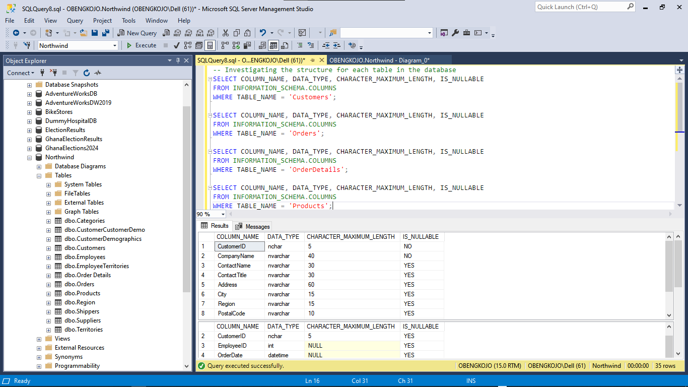

## 2.2 Exploring Table Relationships in the Northwind Database. 🔍
Understanding the relationships that exists among all tables in the database is key to performing accurate and insightful analyses. In this section, I further explored and documented the relationships that exist among all tables. This served as a foundational knowledge for how I approached all business questions and subsequent queries in the Northwind Database.

For this purpose, I used the following approaches:

### 2.2.1 Database Diagramming in SQL Server Management Studio (SSMS):
- ### Process:
  I created a new database diagram within SSMS and added key tables like `Customers`, `Orders`, `OrderDetails`, `Products`, `Suppliers`, `Employees`, `Shippers`, and `Categories`.
In doing so `SSMS` automatically displays the foreign key relationships among tables and helped me to visualize representation of the table structure.

*Query and Output Screenshot.*
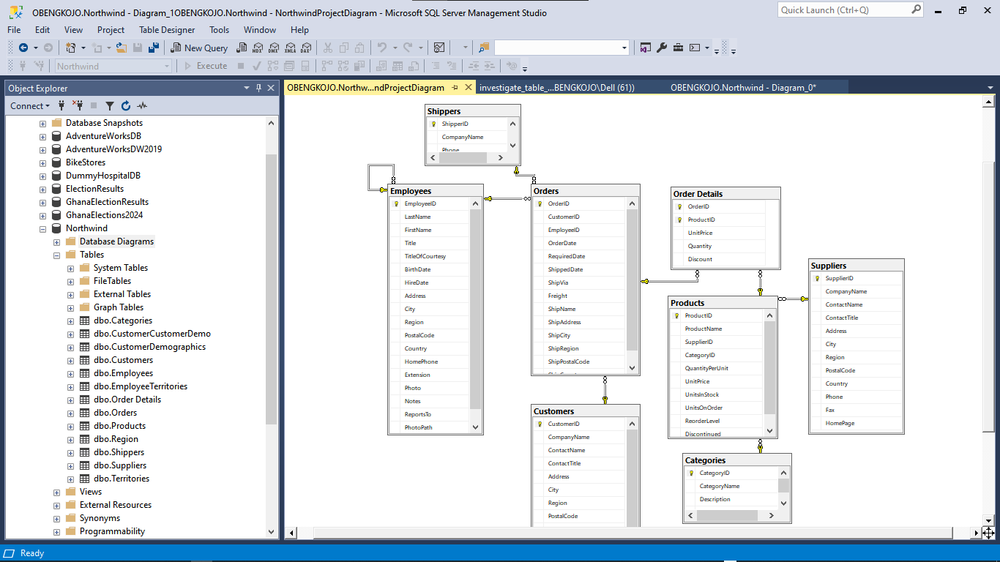

- ### Outcome:
  The diagram helped to reveal the key relationships among table. For example; `orders` linked to `customers`, `order details` is tied to `orders` and `products`). This gave a big-picture view of the data structure and query approach.

### 2.2.2 Exploring Foreign Key Constraints Using SQL Queries:
- ### Process:
  I used SQL queries to examine foreign key constraints directly. This provided details on child-parent table connections. This was helpful for confirming which fields link tables and informed me on how to approach my joint queries.

*Query and Output Screenshot.*
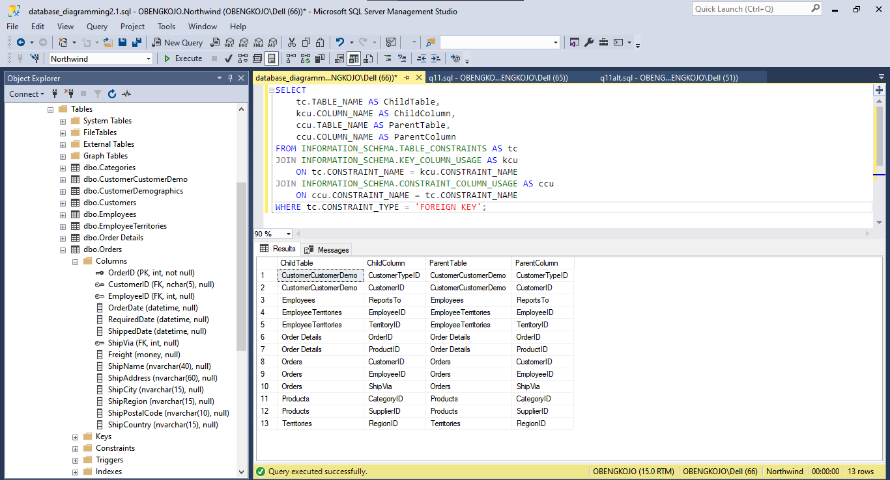

### Query breakdown:
- **SELECT Clause**:
   - `ChildTable`: Displays the name of the table containing the foreign key (referred to as the "child" table).
   - `ChildColumn`: Shows the specific column in the child table that acts as the foreign key.
   - `ParentTable`: Lists the name of the table referenced by the foreign key (the "parent" table).
   - `ParentColumn`: Identifies the column in the parent table that is referenced by the foreign key.
- **JOIN Statements**:
   - The query joins `INFORMATION_SCHEMA.TABLE_CONSTRAINTS` with `INFORMATION_SCHEMA.KEY_COLUMN_USAGE` and `INFORMATION_SCHEMA.CONSTRAINT_COLUMN_USAGE` to access foreign key constraints and their associated columns.
- **WHERE Clause**:
   - Filters results to show only foreign key constraints. this allows enforces only relationships between tables to be displayed.

- ### Outcome:
  This query help provide the list of all relationships where one table (`the child`) references another table (`the parent`) via foreign key constraints. This help to give a clear map of dependencies within the database. A typical example is:
- `Orders.CustomerID` references `Customers.CustomerID`. This indicated a link between `customers` and their respective `orders`.
- `OrderDetails.OrderID` references `Orders.OrderID`. This also shows the connection between `order details` to `specific orders`.

### 2.2.3 Detailed Examination of Individual Table Relationships:
- ### Process:
  I examined each table’s relationships in isolation using `sp_fkeys`. Using `sp_fkeys` on each table helped confirm how it references other tables or how it is referenced by others.

Example just for the Orders Table. Note that this was done for all the tables.

*Query and Output Screenshot.*
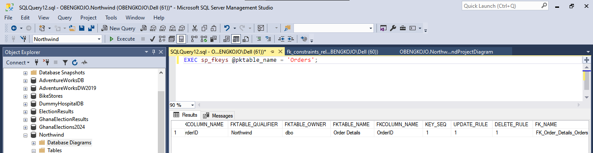

- ### Outcome:
  Using this permitted me to see all references to the Orders table and also helped me to understand the dependencies and connections unique to each table.

### 2.2.4 Exploring Key Constraints in the Object Explorer:
- ### Process:
  Finally I used the Object Explorer to further explore the Keys section under each table by right-clicking on each foreign key to view its `dependencies`.

*Screenshot for the orders table dependencies.*
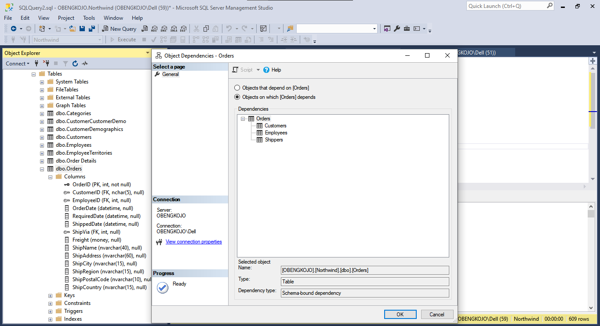

- ### Outcome:
  This helped in viewing the relationships on a table-by-table basis and aided the confirmation of connections discovered in all the early approaches.

### Key Table Relationships Findings
Based on my analysis, below is a summary of the most significant findings I made with the Northwind Database.

| **Child Table**    | **Foreign Key**         | **Parent Table** | **Relationship Description**                                           |
|--------------------|-------------------------|------------------|-----------------------------------------------------------------------|
| **Orders**         | Orders.CustomerID       | Customers        | Links each order to the customer who placed it.                       |
| **OrderDetails**   | OrderDetails.OrderID    | Orders           | Connects each line item to its associated order.                      |
| **OrderDetails**   | OrderDetails.ProductID  | Products         | Associates each line item with a specific product.                    |
| **Products**       | Products.SupplierID     | Suppliers        | Links each product to its supplier.                                   |
| **Products**       | Products.CategoryID     | Categories       | Organizes products into categories.                                   |

These discovered relationships will be the foundational tool for me to the Northwind database's structure and my guide to how tables interact for the various queries I will be using to answer the key business questions and bring the needed insights. This exploration step was needed as the main catalyst to an accurate and meaningful results in the overall project.

---

 <a id="three"></a>
# **❓ 3. Business Questions and Analysis**
<a href=#cont>Back to Project Structure</a>

## Q1: Which customers have placed the most orders❔

*Query and Output Screenshot:*

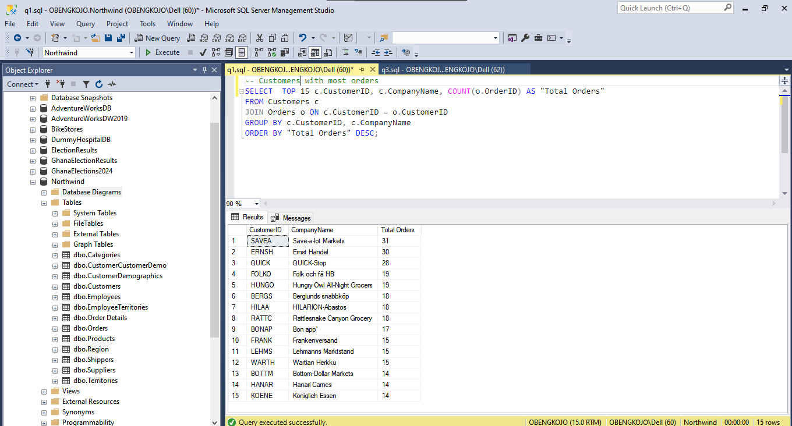

### Output Explanation:
I used this query to count the number of orders each customer has placed. I then joined the `Customers` table with the `Orders` table on `CustomerID`, and selected the `CustomerID` and `CompanyName`, and used `COUNT()` to get the total orders. I grouped the results by `CustomerID` and `CompanyName` and sorted by the order count in descending order, showing customers with the most orders first.

### 🌟Key Insights:
- `Save-a-lot Markets` has placed the most orders, with `31` total orders, followed closely by `Ernst Handel` with `30` orders.
- `QUICK-Stop` ranks third with `28` orders, highlighting a strong purchasing relationship with Northwind.
- Other notable customers include `Folk och fä HB` and `Hungry Owl All-Night Grocers`. Each of them have `19` orders, which indicates consistency in their demand as well.

### 📌Recommendations:
- **Implement a Loyalty Program**: Northwind should offer discounts or benefits for their high-order customers like `Save-a-lot Markets` and `Ernst Handel` to cement their loyalty.
- **Targeted Marketing Campaigns**: Northwind should create personalized campaigns for top customers to encourage more frequent purchases.
- **Dedicated Account Management**: Northwind should assign account managers to top customers to strengthen relationships and for ease in addressing their specific needs.

### 💥Impact Analysis:
- **Increased Customer Retention**: Implemetation of a loyalty program can improve customer retention rates and revenue stability from key accounts.
- **Enhanced Customer Satisfaction**: Dedicating special account managements foster strong customer relationships and potentially leads to increased brand loyalty and positive referrals.
- **Higher Sales Volume**: Adopting targeted campaigns could increase order frequency and result in higher overall sales for Northwind.


---

## Q2: What is the total revenue generated by each product category❔

*Query and Output Screenshot:*

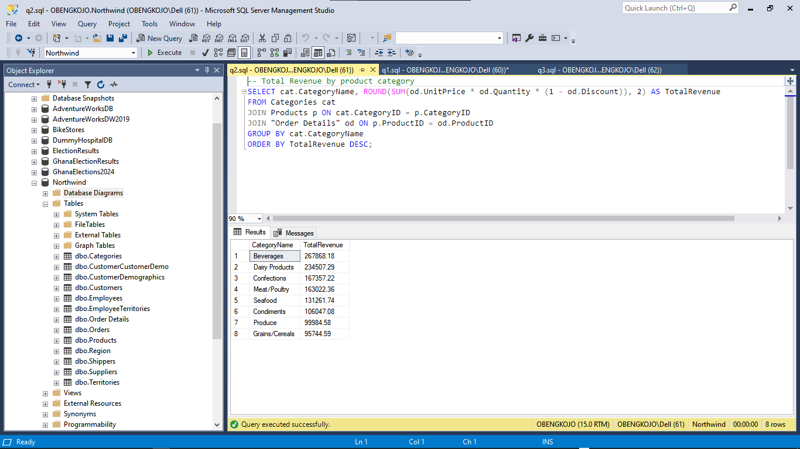

### Output Explanation:
I used this query to calculate the total revenue for each product category. I then joined the `Categories`, `Products`, and `Order Details` tables. I selected the `CategoryName` and calculated the total revenue by multiplying `UnitPrice`, `Quantity`, and applying the discount. I then rounded the results to two decimal places using the `ROUND()` function. I finally grouped the results by `CategoryName` and sorted in descending order of total revenue to show the categories with the highest revenue first.

### 🌟Key Insights:
- `Beverages` and `Dairy Products` are the top revenue-generating categories for Northwind. Recording `$267,868.18` and `$234,507.29`, respectively.
- `Confections` and `Meat/Poultry` follow closely. This also highlights their importance to Northwind's total revenue.

### 📌Recommendations
- **Increase Stock for High-Demand Categories**: Northwind need to ensure sufficient inventory for top categories like `Beverages` and `Dairy Products` to prevent stockouts and support demand.
- **Targeted Marketing Campaigns**: Northwind needs to run promotions for high-revenue categories to further boost sales. They need to also focus on creating campaigns to increase visibility for lower-revenue categories like `Condiments`, `Produce` and `Grains/Cereals` .
- **Optimize Pricing Strategy**: Northwind may want to analyze the pricing and discount strategies for all the low-performing categories to make them more competitive and attractive.

### 💥Impact Analysis
- **Enhanced Revenue Growth**: Manangement decision to prioritize top categories could significantly boost overall revenue and help align with customer demand.
- **Improved Customer Satisfaction**: By always ensuring availability of popular items, Northwind can improve customer satisfaction and retention.
- **Optimized Resource Allocation**: Ability to focus more resources on profitable categories can improve efficiency in inventory management, marketing, and sales investments.

--- 

## Q3: What are the most popular products by sales quantity❔

*Query and Output Screenshot:*

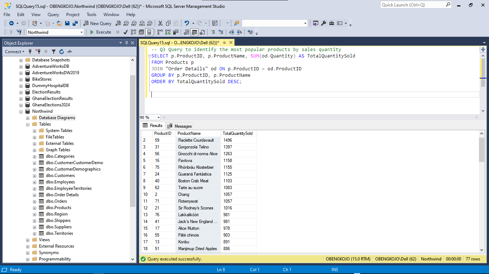

### Output Explanation:
I used the query join `Products` and `OrderDetails` to calculate the total quantity sold for each product. By grouping by `ProductID` and `ProductName` and using `SUM(od.Quantity)`, I was able to get the total quantity sold for each product. Finaly, sorting by `TotalQuantitySold` in descending order `(DESC)` helped to highlight the most popular products.

### 🌟Key Insights:
- `Camembert Pierrot` and `Raclette Courdavault` are the top-selling products, with `1,577` and `1,496` units sold, respectively.
- `Gorgonzola Telino` and `Gnocchi di nonna Alice` are also in high demand, with over `1,200` units sold each.

### 📌Recommendations:
- **Stock Prioritization**: Northwind needs to ensure that high-demand products like `Camembert Pierrot` and `Raclette Courdavault` are well-stocked to meet demand at all times.
- **Targeted Marketing**: Northwind needs to focus promotions on top-selling products to boost sales and attract more customers to popular items.
- **Supplier Relationships**: Northwind needs to strengthen partnerships with suppliers of high-demand products to secure better pricing and constant stable inventory levels.

### 💥Impact Analysis:
- **Reduced Stockouts**: Prioritizing stock for popular items reduces the risk of stockouts, improving customer satisfaction and retention.
- **Increased Revenue**: Targeted promotions for best-sellers can drive higher sales volumes and boost revenue.
- **Operational Efficiency**: Better planning and supplier coordination streamline inventory management, reducing costs and improving profitability.

---

## Q4: Who are the top-performing employees based on the total number of orders handled❔
*Query and Output Screenshot:*

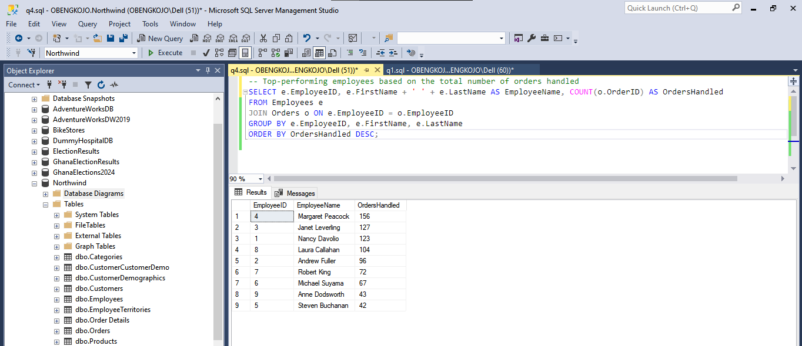

### Output Explanation:
I used this query to join the `Employees` and `Orders` tables to count the total number of orders handled by each employee. By grouping by `EmployeeID`, `FirstName`, and `LastName` and using the `COUNT(o.OrderID)` function, the query calculates the number of orders assigned to each employee. Finally, I sorted by `OrdersHandled` in descending order `(DESC)` to allow the highlighting of the top-performing employees in terms of order volume.

### 🌟Key Insights:
- `Margaret Peacock` is the top performer, handling a total of `156` orders.
- `Janet Leverling` and `Nancy Davolio` follow closely with `127` and `123` orders, respectively.
- Employees like `Andrew Fuller`, `Laura Callahan`, and `Robert King` have handled over `90` orders, showing a strong performance.
- The bottom performers in this list, `Steven Buchanan` and `Anne Dodsworth`, handled fewer than `50` orders each, indicating areas where performance improvement may be needed.

### 📌Recommendations
- **Reward Top Performers**: Northwind should recognize and incentivize high-performing employees like `Margaret Peacock`, `Janet Leverling`, `Nancy Davolio` and others to maintain their morale and productivity while encouraging others to do more.
- **Training for Low Performers**: Northwind needs to provide additional training and support to employees with lower order volumes, such as `Steven Buchanan` and `Anne Dodsworth`, to help boost their productivity level.
- **Balanced Workload**: Northwind should redistribute order assignments to balance workloads and prevent burnout among top-performing employees. This will enhance employees overall efficiency.

### 💥Impact Analysis
- **Increased Productivity**: Rewarding top performers and providing support to lower performers can drive productivity across the team.
- **Improved Employee Retention**: Recognizing and supporting employees fosters a positive work environment and potentially reduces turnover.
- **Enhanced Customer Satisfaction**: A balanced workload and efficient staff can lead to quicker order handling which will lead to an improved customer satisfaction and loyalty.

---

## Q5: What are the sales trends over time (monthly, quarterly, and yearly)❔
*Query and Output Screenshot:*

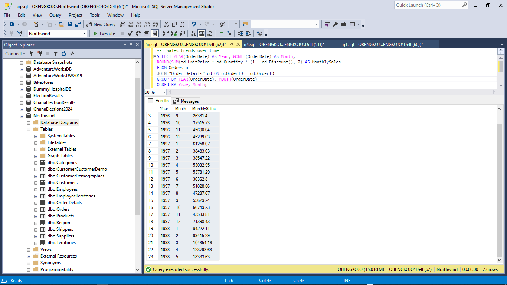

### Output Explanation:
I used this query to calculate the total sales for each month by joining the `Orders` and `OrderDetails` tables. By using `YEAR(OrderDate)` and `MONTH(OrderDate)`, I grouped the data by year and month. The `SUM(od.UnitPrice * od.Quantity * (1 - od.Discount))` expression calculates the total sales, factoring in product prices, quantities, and any discounts applied. Sorting the result by year and month ensured that the sales trend was displayed chronologically.

### 🌟Key Insights:
- **Sales Growth**: There is a noticeable increase in monthly sales over the years in Northwind.  Specifically in 1997 and 1998.
- In `1996`, sales started relatively low but saw significant growth in the latter months, with December reaching over `$45,000` in total sales.
- `1997` showed consistent sales growth, with peak months like `October` and `December`, which generated over  `$67,000` and `$71,000` in monthly sales, respectively.
- `1998` continued the trend, with `April` seeing the highest sales value of over `$123,000`.
- **Sales Fluctuations**: Some months, such as `May 1998`, show lower sales compared to others, indicating seasonal fluctuations that could be explored further (maybe impact of holidays or other economic factors).

### 📌Recommendations:
- **Increase Inventory for Peak Months**: Northwind needs to boost stock levels before high-sales months like `October` and `December` to meet demand and avoid stockouts.
- **Seasonal Promotions**: Northwind needs to launch promotions in low-sales months, such as `May`, to boost revenue during slower periods.
- **Analyze High-Growth Periods**: Northwind needs to study other factors driving high sales in `April` and `December` for strategies to replicate this growth in other months.

### 💥Impact Analysis:
- **Improved Revenue**: Adequate inventory and targeted promotions can capture higher sales, especially during peak months, maximizing revenue.
- **Efficient Cash Flow**: Adjusting stock levels based on demand trends ensures efficient cash management and reduces carrying costs.
- **Optimized Marketing Strategy**: Seasonal insights enable data-driven campaigns, increasing customer engagement and potentially boosting sales in lower-demand months.

---
## Q6: How do discounts affect the order frequency and quantity of purchased products❔
*Query and Output Screenshot:*

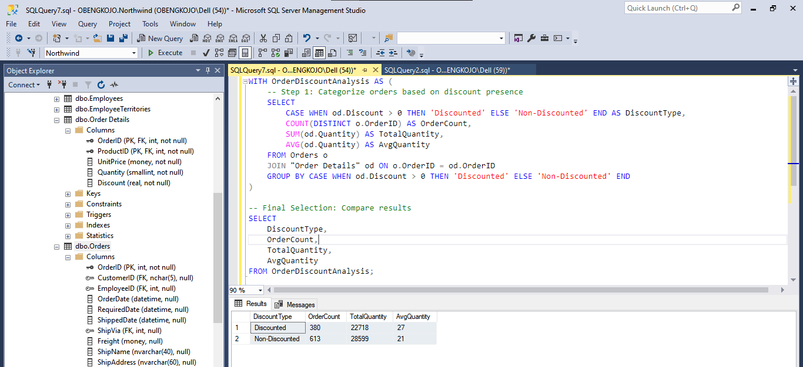

### Output Explanation:
I used this query to categorize orders into two types based on whether a discount was applied or not. I used a `CASE` statement to label orders as either "Discounted" or "Non-Discounted." I then aggregated data to count the number of distinct orders (`OrderCount`), calculate the total quantity of products ordered (`TotalQuantity`), and found the average quantity per order (`AvgQuantity`). By grouping the results based on the discount type, the analysis compared the behavior of discounted versus non-discounted orders.

### 🌟Key Insights:
- **Discounted Orders**: There were `380` orders with a discount, with a total quantity of `22,718` products purchased and an average of `27` units per order.  
- **Non-Discounted Orders**: There were `613` orders without discounts, with a total of `28,599` products purchased and an average of `21` units per order.  
- **Impact of Discounts**: Orders with discounts have a *lower frequency* (`380` orders) compared to non-discounted orders (`613` orders). However, discounted orders have a **higher average quantity** of products per order (`27` units) compared to non-discounted orders (`21` units).
  - The total quantity for discounted orders is only slightly lower (`22,718` vs `28,599`), but this is offset by fewer orders in the discounted category.

### 📌Recommendations:
- **Increase Frequency of Discount Offers**: Northwind needs to increase the number of discounted orders by offering more frequent or targeted promotions. By expanding the reach of discount offers, Northwind can boost the overall order count, maintaining higher order volume and sales.
- **Bundle Products for Larger Purchases**: Northwind needs to implement product bundles where discounts apply only when certain quantities are purchased. This would encourage customers to buy larger quantities per order, similar to the trend seen in the analysis of discounted orders.
- **Personalized Discount Campaigns**: Northwind needs to utilize customer data to offer personalized discounts based on purchase history. Targeting high-value customers with tailored discounts can further increase the average quantity per order while enhancing customer loyalty.

### 💥Impact Analysis:
- **Revenue Impact**: Increasing the frequency of discounts could lead to higher overall sales volume. Although the frequency of discounted orders is currently lower, promoting more discount-driven purchases will likely increase both revenue and total order quantity.
- **Customer Retention and Loyalty**: Personalized discount campaigns can improve customer retention by incentivizing repeat purchases. This will create a sense of loyalty, as customers feel valued with special offers tailored to their buying behavior.
- **Inventory Management**: By bundling products and offering discounts based on larger quantities, Northwind can better manage stock levels. This strategy will reduce overstocking or stockouts by aligning customer demand with inventory needs, improving supply chain efficiency.

---

## Q7: What percentage of orders include a discount, and how does it impact overall revenue❔
*Query and Output Screenshot:*

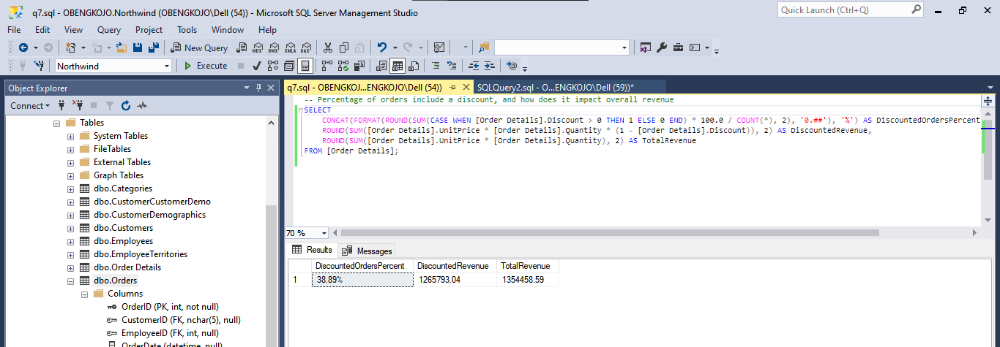

### Output Explanation:
I usde this query to calculate two key metrics: 1. the percentage of orders that include a discount and 2. the overall impact of those discounts on the revenue. It works by first counting the number of orders in the `OrderDetails` table where the `Discount` is greater than 0 and dividing it by the total number of orders. Multiplying by 100 returned the percentage of orders with discounts. The query also calculated the total revenue from orders that included a discount (**DiscountedRevenue**) and compares it with the total revenue from all orders (**TotalRevenue**).

### 🌟Key Insights:
- `38.89%` of the orders in the dataset included a discount.
- The `discounted revenue` amounts to `$1,265,793.04`, while the `total revenue` from all orders is `$1,354,458.59`. This means that `discounted orders` contributed to approximately `93.44%` of the total revenue. This is an indication of a significant impact of discounts on overall sales.
- The results highlight that while fewer orders received discounts, these orders ended up making up a large portion of the revenue. This suggests that discounting is a powerful tool for driving higher-value sales.

### 📌Recommendations:
- **Optimize Discount Thresholds**: Northwind needs to increase minimum purchase requirements for discounts to maintain revenue while reducing potential profit loss.
- **Targeted Discounting**: Northwind needs to offer discounts on high-margin products or underperforming items to maximize revenue without over-discounting popular products.
- **Seasonal Promotions**: Northwind needs to implement discounts during peak seasons to boost sales volume and focus on product categories that benefit most from discount incentives.

### 💥Impact Analysis:
- **Revenue Boost**: Discounts account for a significant portion (93.44%) of total revenue, indicating their power in driving sales volume.
- **Profit Margins**: High discount-driven revenue can erode profit margins if not managed; selective discounting could balance revenue gains with profitability.
- **Customer Behavior**: A high percentage of discounted orders suggests customer sensitivity to discounts, highlighting the importance of strategic discount placement to maximize customer retention and purchase frequency.

---

## Q8: Which regions (by customer location) generate the highest revenue❔
*Query and Output Screenshot:*

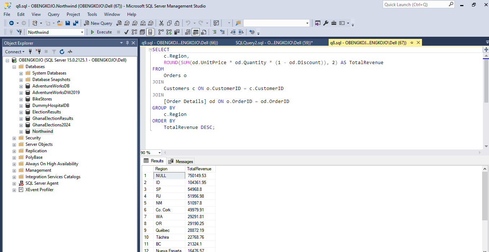

### Output Explanation:
I used this query  to join `Orders`, `Customers`, and `Order Details` to calculate the total revenue generated by each region. By grouping the results by `Region` and using the formula `SUM(od.UnitPrice * od.Quantity * (1 - od.Discount))`, I computed the total revenue per region. The results was then sorted by `TotalRevenue` in descending order `(DESC)` to highlight the regions that generate the highest revenue.

### 🌟Key Insights:
- The `NULL` region, which I presume represents customers with missing or unspecified region information happens to generate the highest revenue with a total of `$750,149.53`.
- **ID Region** follows with `$104,361.95` in total revenue.
- Regions such as `SP`, `RJ`, and `NM` are also significant revenue generatoring areas as they contribute over `$50,000` in revenue each.
- Less prominent regions like `DF` and `MT` generate relatively low revenue, with totals revenues under `$2,000`.

### 📌 Recommendations:
- **Improve Data Quality in the `Region` Field**: Since the `NULL` region generates the highest revenue, it’s crucial for Northwind to investigate and update missing regional information. Standardizing this field will enable better geographic insights and more targeted strategies.
- **Focus Marketing Efforts on High-Revenue Regions**: Targeted marketing campaigns should prioritize regions with high revenue, such as `ID`, `SP`, and `RJ`. Ability to tailor a promotion or special sales offers for these areas could further enhance revenue and customer loyalty.
- **Explore Growth Opportunities in Low-Revenue Regions**: Regions like `DF` and `MT` present opportunities for growth. Strategies like localized advertising, regional partnerships, or promotions could boost engagement and sales in these underperforming areas.

### 💥 Impact Analysis:
- **Enhanced Regional Insights**: By updating missing region information, Northwind can achieve more accurate analyses and tailor region-specific initiatives, likely increasing revenue across targeted markets.
- **Increased Revenue from Targeted Marketing**: By focusing efforts on high-revenue regions, Northwind may see a rise in revenue from its strongest markets, optimizing marketing ROI and strengthening customer relationships in these profitable areas.
- **Growth in Underperforming Regions**: Targeted strategies for low-revenue regions could help boost sales and expand Northwind’s market reach. This approach may foster a more balanced revenue distribution across regions and uncover new growth opportunities.
---

## Q9: What are the top products in each high-revenue region❔
*Query and Output Screenshot:*


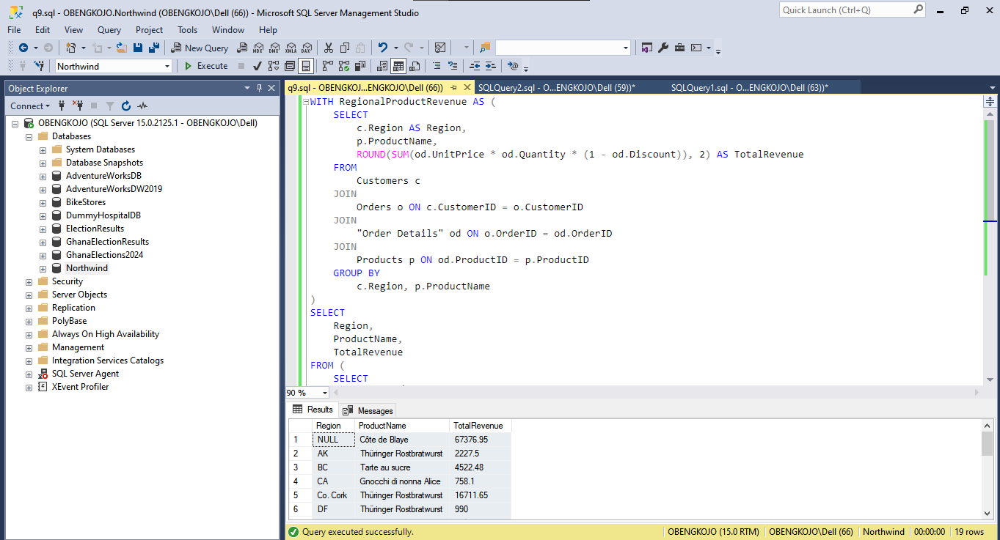

### Output Explanation:
This query determines the top-selling product by revenue in each high-revenue region by joining the `Customers`, `Orders`, `Order Details`, and `Products` tables. The `WITH` clause calculates `TotalRevenue` for each product in each region by summing up the revenue generated (`UnitPrice * Quantity * (1 - Discount)`). Then, the outer query ranks products within each region by revenue, using `ROW_NUMBER()` to identify the top product in each region. Filtering on `RevenueRank = 1` ensures only the highest-revenue product in each region is displayed.

### 🌟Key Insights:
- The product `"Côte de Blaye"` is a top seller in multiple regions `(e.g., WA, OR, RJ, and SP)`, indicating consistent demand across various regions.
- `"Thüringer Rostbratwurst"` shows strong performance in multiple regions like `AK`, `Co. Cork`, and `MT`, suggesting its popularity in those areas.
- Regions such as `Québec` and `OR` contribute significant revenue from high-demand items like `Côte de Blaye`, signaling potential markets for focused marketing or inventory investment.
- Regions with unique top-selling products, such as `Isle of Wight` with `Sirop d'érable`, highlight localized preferences that could be leveraged in targeted promotional strategies.
- The `NULL` values in the `Region` column indicate missing regional data for some customer records. However, products sold to these `NULL` regions—such as "Côte de Blaye" with revenue of `$67,376.95` still contribute significantly to Northwind revenue. This data gap limits Northwind's ability to target marketing, optimize inventory, and perform regional analysis, as customers with incomplete location details cannot be reached for tailored promotions or efficient inventory allocation.


### 📌 Recommendations:
- **Increase Stock for High-Demand Products**: Northwind needs to prioritize inventory for products like `"Côte de Blaye"` and `"Thüringer Rostbratwurst"` that consistently perform well across multiple regions. This will prevent stockouts, reduce missed sales opportunities, and enhance customer satisfaction.
- **Implement Targeted Marketing Campaigns**: Northwind needs to tailor marketing strategies by region to focus on high-revenue products. For instance, campaigns in `Québec` and `OR` could emphasize `"Côte de Blaye"` promotions, while areas like `Isle of Wight` could focus on regional preferences like `Sirop d'érable`.
- **Address Data Gaps**: The presence of `NULL` values in regional data suggests a need for data quality improvements. Ensuring that customer locations are accurately recorded will enable more refined regional analysis, better targeting, and precise inventory allocation. 
- **Leverage Localized Product Preferences**: For regions with unique top-sellers, Northwind needs to consider localized merchandising or exclusive offers. By highlighting products that have strong regional popularity like `"Sirop d'érable"` in `Isle of Wight` Northwind can deepen customer loyalty and engagement in those areas.
- **Consider Regional Expansion or Investment**: Based on revenue contributions from regions like `Québec`, `OR`, and `RJ`, Northwind could explore further market opportunities, such as increased distribution channels or partnerships in these areas.

### 💥 Impact Analysis:
- *Revenue Growth*: By focusing on top products in high-revenue regions, Northwind can increase sales and maximize profitability, especially by preventing stockouts of in-demand items.
- *Customer Engagement and Retention*: Targeted campaigns based on popular products in each region can enhance customer loyalty and engagement, as they feel their preferences are recognized and valued.
- *Operational Efficiency*: Addressing data gaps will streamline inventory and marketing efforts, allowing Northwind to more effectively allocate resources and reduce waste from unsold stock.
- *Strategic Market Insights*: Leveraging region-specific product preferences enables Northwind to identify potential areas for expansion, allowing for growth in high-performing regions and the opportunity to adjust to customer trends effectively.

---

## Q10: What is the customer retention rate over a given period❔
*Query and Output Screenshot:*

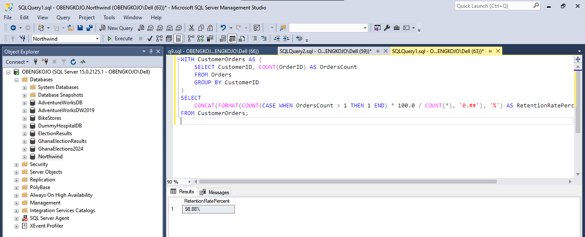

### Output Explanation:
I used this query to calculate the customer retention rate over a given period by analyzing the frequency of orders placed by each customer. I began by creating a common table expression (`CustomerOrders`) that counts the total number of orders for each customer in the `Orders` table. I then used it in the main to determine the percentage of customers who have placed more than one order (indicating retained customers) by dividing the count of such customers by the total number of customers and finally formatting the result as a percentage.

### 🌟Key Insights:
- The customer retention rate is high, with `98.88%` of customers placing multiple orders.
- The high retention rate indicates that Northwind has strong customer loyalty and repeat purchasing behavior. This may suggest satisfaction with the products, services offered and other factors.
- This insight could be leveraged to enhance customer lifetime value by focusing on personalized promotions, loyalty programs, or incentives to maintain or further improve the retention rate.

### 📌Recommendation:
Northwind should implement (if not already) or improve their **Customer Loyalty Program** to incentivize repeat purchases and increase customer engagement.

### 💥Impact Analysis:
- **Boost Customer Lifetime Value**: Rewards to customers for thier frequent purchases can increase average revenue per customer.
- **Enhance Brand Loyalty**: A loyalty program strengthens customer commitment and retention.
- **Drive Revenue Growth**: Incentives for repeat purchases can increase order frequency and size.

---

## Q11: How do employee productivity and customer satisfaction relate (based on order completeness and delivery time)❔
*Query and Output Screenshot:*

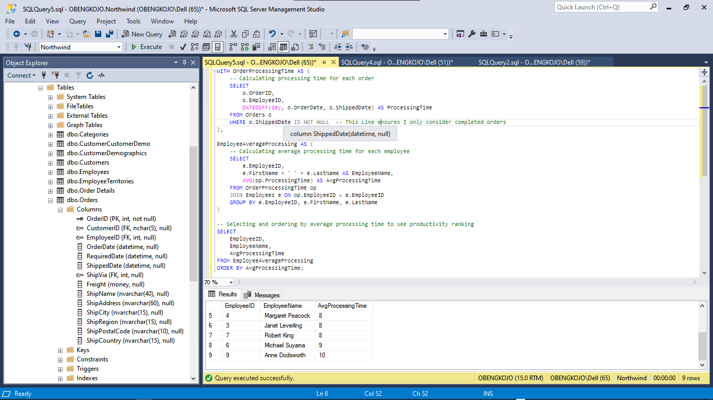

### Output Explanation:
I used this query to calculate the average processing time for each employee by first determining the processing time for each order (the difference between `OrderDate` and `ShippedDate`). I then aggregated this information to calculate the average processing time per employee. Finally, I sorted the results by `AvgProcessingTime`, which provided a ranking of employees based on their efficiency in processing orders.

### 🌟Key Insights:
- **Nancy Davolio** and **Steven Buchanan** are the most efficient employees, with an average processing time of `7`.
- **Andrew Fuller**, **Laura Callahan*, **Margaret Peacock**, **Janet Leverling**, **Robert King**, and **Michael Suyama** have an average processing time of `8`, which suggests that their order processing is slightly slower compared to `Nancy` and `Steven`.
- **Anne Dodsworth** has the slowest processing time, with an average of `10`. This indicates that there may be room for improvement in her order processing efficiency.

### 📌Recommendations:
- **Training for Slow Processors**: Provide additional training to employees with slower processing times like `Anne Dodsworth` to help improve her efficiency.
- **Process Optimization**: Streamline order processing steps for employees with higher average times to reduce delays.
- **Performance Incentives**: Offer rewards or recognition for top performers like `Nancy Davolio` and `Steven Buchanan` to maintain high productivity levels and encourage other employee to emulate.

### 💥Impact Analysis:
- **Faster Order Fulfillment**: Improving processing times will result in quicker deliveries, leading to higher customer satisfaction.
- **Resource Allocation**: By identifying slower processors, resources can be allocated to provide targeted support, boosting overall efficiency.
- **Employee Morale**: Recognizing high performers and providing training for others will foster a positive work environment and encourage continuous improvement.

---

 <a id="four"></a>
# **🔚 3. Conclusion**
<a href=#cont>Back to Project Structure</a>

In this project, I used the Northwind database to analyze key business metrics which helped me to gain valuable insights into customer behavior, product performance, and employee productivity. Through SQL queries, I identified top customers, evaluated sales trends, and assessed the impact of discounts on order frequency and quantity.

## Key findings include:
- **Customer Engagement**: Customers with higher order frequencies contribute significantly to overall revenue of Northwind Trader. This suggests that engagement strategies should focus on repeat buyers.
- **Employee Productivity**: Employees who process orders faster are linked to improved operational efficiency. This could lead to better customer satisfaction and quicker delivery times.
- **Discount Strategy**: Discounts had a positive effect on both order frequency and total quantity purchased. This indicates that targeted discount strategies can help in driving bulk buying and increase sales volume.

This analysis demonstrates the power of data-driven decision-making and showcases how practical insights can inform business strategies and optimize operations. Through this project, I showcased my ability to use both basic and complex SQL for data extraction and data aggregations and ultimately providing actionable recommendations for business growth.


