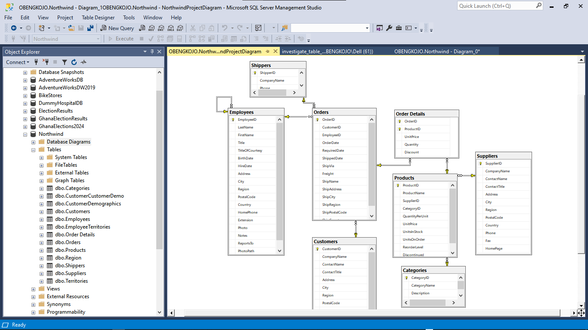

# Northwind Business Analysis Project

## Database Overview
The Northwind database is a database provided by `Microsoft` that models a fictional company called Northwind Traders. This fictious company imports and exports specialty foods from all around the world. The database is organized around typical sales and supply chain data, making it useful for an ideal project that showcase how to handle common business scenarios.
It includes information about orders, customers, suppliers, products, employees, and shippers.
 
## Objective
To analyze Northwind Traders' business data and gain actionable insights in areas such as customer behavior, sales trends, product performance, and employee productivity using SQL in SSMS.

## Tools and Technologies Used

- **SQL Server Management Studio (SSMS)**: Primary tool for writing, testing, and executing SQL queries on the Northwind database.
- **SQL Server**: The relational database management system that hosts the Northwind database.
- **Microsoft Excel**: Used for data visualization and reporting, particularly for exporting query results and creating visual summaries.
- **SQL Server Reporting Services (SSRS)** *(Optional)*: For creating detailed reports and dashboards from SQL query results.
- **Common Table Expressions (CTEs)**: Utilized to structure complex queries and improve readability.
- **Subqueries** and **Joins**: Essential SQL techniques for connecting and analyzing data across multiple tables.
- **Window Functions**: Advanced SQL functions for performing calculations across sets of table rows.

## Skills Learned or Employed

- **SQL Querying**: Proficient in foundational SQL, including `SELECT`, `INSERT`, `UPDATE`, and `DELETE`.
- **Data Aggregation**: Learned to use aggregation functions like `SUM`, `COUNT`, `AVG` to summarize data meaningfully.
- **Data Analysis**: Developed skills in analyzing business data to answer questions on sales, customer behavior, and employee productivity.
- **Database Relationships**: Gained practical experience with primary keys, foreign keys, and joins to navigate relational database structures.
- **Advanced SQL Techniques**: Employed window functions, CTEs, subqueries, and `CASE` statements for complex analyses.
- **Business Intelligence**: Improved ability to derive actionable insights from raw data, using SQL to model and answer real-world business questions.
- **Reporting and Visualization**: Used Excel and SSRS for visualizing and presenting data insights effectively.

## 1. Exploring the Database Structure
Before starting, I will first examine the main tables within the database using DESCRIBE in SQL server. Doing this will allow me to get a better understanding of each table's structure: The tables to investigate includes; Customers, Employees, Orders, OrderDetails, Products, Suppliers, and Categories Tables.

## 2. Exploring Table Relationships in the Northwind Database
Understanding the relationships that exists among all tables in the database is key to performing accurate and insightful analyses. This section of my prpject sseks to further explore and documents these relationships to serve as my foundational knowledge for all subsequent queries and business questions I will be answering with this database.
For the purpose, I used the following approaches:

### 2.1 Database Diagramming in SQL Server Management Studio (SSMS):
- `Process:`
  
I created a new database diagram within SSMS and added key tables: Customers, Orders, OrderDetails, Products, Suppliers, Employees, Shippers, and Categories.
In doing so `SSMS` automatically displays the foreign key relationships among tables and helped me to visualize representation of the table structure.

**Outcome:**

The diagram revealed key relationships (e.g., orders linked to customers, order details tied to orders and products), giving a big-picture view of the data structure.
A screenshot of the database diagram I created.


### 2.2 Exploring Foreign Key Constraints Using SQL Queries:
I used SQL queries to examine foreign key constraints directly. This provided details on child-parent table connections. This was helpful for confirming which fields link tables.

A screenshot of the query and output.

```sql
SELECT 
    tc.TABLE_NAME AS ChildTable,
    kcu.COLUMN_NAME AS ChildColumn,
    ccu.TABLE_NAME AS ParentTable,
    ccu.COLUMN_NAME AS ParentColumn
FROM INFORMATION_SCHEMA.TABLE_CONSTRAINTS AS tc
JOIN INFORMATION_SCHEMA.KEY_COLUMN_USAGE AS kcu
    ON tc.CONSTRAINT_NAME = kcu.CONSTRAINT_NAME
JOIN INFORMATION_SCHEMA.CONSTRAINT_COLUMN_USAGE AS ccu
    ON ccu.CONSTRAINT_NAME = tc.CONSTRAINT_NAME
WHERE tc.CONSTRAINT_TYPE = 'FOREIGN KEY';
```
**Query breakdown:**

- **SELECT Clause**:
   - `ChildTable`: Displays the name of the table containing the foreign key (referred to as the "child" table).
   - `ChildColumn`: Shows the specific column in the child table that acts as the foreign key.
   - `ParentTable`: Lists the name of the table referenced by the foreign key (the "parent" table).
   - `ParentColumn`: Identifies the column in the parent table that is referenced by the foreign key.
- **JOIN Statements**:
   - The query joins `INFORMATION_SCHEMA.TABLE_CONSTRAINTS` with `INFORMATION_SCHEMA.KEY_COLUMN_USAGE` and `INFORMATION_SCHEMA.CONSTRAINT_COLUMN_USAGE` to access foreign key constraints and their associated columns.
- **WHERE Clause**:
   - Filters results to show only foreign key constraints, so only relationships between tables are displayed.

**Outcome**: 

This query provides a list of relationships where one table (child) references another table (parent) via foreign key constraints, giving a clear map of dependencies within the database. For example:

- `Orders.CustomerID` references `Customers.CustomerID`, indicating a link between customers and their respective orders.
- `OrderDetails.OrderID` references `Orders.OrderID`, connecting order details to specific orders.

### 2.3 Detailed Examination of Individual Table Relationships:
I also examined each table’s relationships in isolation using the `sp_fkeys`. Using `sp_fkeys` on each table helped confirm which tables reference each or are referenced by each.

Example for for just the Orders Table. Note that this was done for all the tables.

Query: A screenshot of the query and output.

```sql
EXEC sp_fkeys @pktable_name = 'Orders';
```
**Outcome:**
Using this permitted me to see all references to the Orders table and also helped me to understand the dependencies and connections unique to each table.

### 2.4 Exploring Key Constraints in the Object Explorer:
Finally I used the Object Explorer to further explore the Keys section under each table by right-clicking on each foreign key to view its dependencies.

**Outcome:**

This helped in viewing the relationships on a table-by-table basis, therefore being able to confirm connections discovered in the above steps.

## Key Findigs after Investigating Table Relationships

Below is a summary of the most significant findings I made with the Northwind Database.

| **Child Table**    | **Foreign Key**         | **Parent Table** | **Relationship Description**                                           |
|--------------------|-------------------------|------------------|-----------------------------------------------------------------------|
| **Orders**         | Orders.CustomerID       | Customers        | Links each order to the customer who placed it.                       |
| **OrderDetails**   | OrderDetails.OrderID    | Orders           | Connects each line item to its associated order.                      |
| **OrderDetails**   | OrderDetails.ProductID  | Products         | Associates each line item with a specific product.                    |
| **Products**       | Products.SupplierID     | Suppliers        | Links each product to its supplier.                                   |
| **Products**       | Products.CategoryID     | Categories       | Organizes products into categories.                                   |

These discovered relationships will be the foundational tool for me to the Northwind database's structure and my guide to how tables interact for the various queries I will be using later to answer the key business questions and bring the needed insights. This exploration step was vital to ensuring an accurate and meaningful results in the overall project.

---

## Business Questions and Analysis
### Q1: Which customers have placed the most orders?

Query: A screenshot of the query and output that answers Q1.

```sql
SELECT c.CustomerID, c.CompanyName, COUNT(o.OrderID) AS "Total Orders"
FROM Customers c
JOIN Orders o ON c.CustomerID = o.CustomerID
GROUP BY c.CustomerID, c.CompanyName
ORDER BY "Total Orders" DESC;
```
The query counts the number of orders each customer has placed. It then joins the `Customers` table with the `Orders` table on `CustomerID`, selects the `CustomerID` and `CompanyName`, and uses `COUNT()` to get the total orders. The results are grouped by `CustomerID` and `CompanyName` and sorted by the order count in descending order, showing customers with the most orders first.

### Q2: What is the total revenue generated by each product category?

Query: A screenshot of the query and output that answers Q2.

```sql
SELECT cat.CategoryName, SUM(od.UnitPrice * od.Quantity * (1 - od.Discount)) AS TotalRevenue
FROM Categories cat
JOIN Products p ON cat.CategoryID = p.CategoryID
JOIN OrderDetails od ON p.ProductID = od.ProductID
GROUP BY cat.CategoryName
ORDER BY TotalRevenue DESC;
```
This query calculates the total revenue for each product category. It joins the `Categories`, `Products`, and `Order Details` tables. It selects the `CategoryName` and calculates the total revenue by multiplying `UnitPrice`, `Quantity`, and applying the discount. The result is then rounded to two decimal places using the `ROUND()`. The results are grouped by `CategoryName` and sorted in descending order of total revenue, showing categories with the highest revenue first.
**Answer:**
