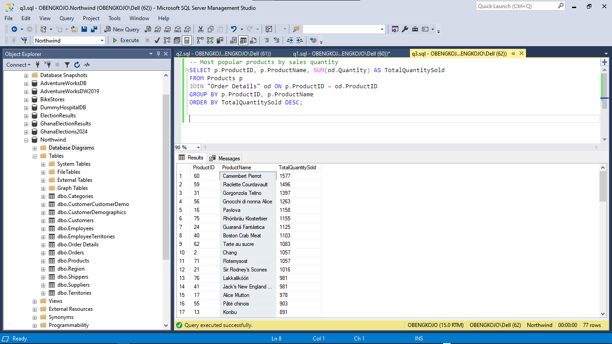

# Northwind Business Analysis Project

## Database Overview
The Northwind database is a database provided by `Microsoft` that models a fictional company called Northwind Traders. This fictious company imports and exports specialty foods from all around the world. The database is organized around typical sales and supply chain data, making it useful for an ideal project that showcase how to handle common business scenarios.
It includes information about orders, customers, suppliers, products, employees, and shippers.
 
## Objective
To analyze Northwind Traders' business data and gain actionable insights in areas such as customer behavior, sales trends, product performance, and employee productivity using SQL in SSMS.

## Tools and Technologies Used

- **SQL Server Management Studio (SSMS)**: Primary tool for writing, testing, and executing SQL queries on the Northwind database.
- **SQL Server**: The relational database management system that hosts the Northwind database.
- **Microsoft Excel**: Used for data visualization and reporting, particularly for exporting query results and creating visual summaries.
- **SQL Server Reporting Services (SSRS)** *(Optional)*: For creating detailed reports and dashboards from SQL query results.
- **Common Table Expressions (CTEs)**: Utilized to structure complex queries and improve readability.
- **Subqueries** and **Joins**: Essential SQL techniques for connecting and analyzing data across multiple tables.
- **Window Functions**: Advanced SQL functions for performing calculations across sets of table rows.

## Skills Learned or Employed

- **SQL Querying**: Proficient in foundational SQL, including `SELECT`, `INSERT`, `UPDATE`, and `DELETE`.
- **Data Aggregation**: Learned to use aggregation functions like `SUM`, `COUNT`, `AVG` to summarize data meaningfully.
- **Data Analysis**: Developed skills in analyzing business data to answer questions on sales, customer behavior, and employee productivity.
- **Database Relationships**: Gained practical experience with primary keys, foreign keys, and joins to navigate relational database structures.
- **Advanced SQL Techniques**: Employed window functions, CTEs, subqueries, and `CASE` statements for complex analyses.
- **Business Intelligence**: Improved ability to derive actionable insights from raw data, using SQL to model and answer real-world business questions.
- **Reporting and Visualization**: Used Excel and SSRS for visualizing and presenting data insights effectively.

## 1. Exploring the Database Structure
Before starting, I will first examine the main tables within the database using DESCRIBE in SQL server. Doing this will allow me to get a better understanding of each table's structure: The tables to investigate includes; Customers, Employees, Orders, OrderDetails, Products, Suppliers, and Categories Tables.

## 2. Exploring Table Relationships in the Northwind Database
Understanding the relationships that exists among all tables in the database is key to performing accurate and insightful analyses. This section of my prpject sseks to further explore and documents these relationships to serve as my foundational knowledge for all subsequent queries and business questions I will be answering with this database.
For the purpose, I used the following approaches:

### 2.1 Database Diagramming in SQL Server Management Studio (SSMS):
- `Process:`
  
I created a new database diagram within SSMS and added key tables: Customers, Orders, OrderDetails, Products, Suppliers, Employees, Shippers, and Categories.
In doing so `SSMS` automatically displays the foreign key relationships among tables and helped me to visualize representation of the table structure.

**Outcome:**

The diagram revealed key relationships (e.g., orders linked to customers, order details tied to orders and products), giving a big-picture view of the data structure.

A screenshot of the database diagram I created.


### 2.2 Exploring Foreign Key Constraints Using SQL Queries:
I used SQL queries to examine foreign key constraints directly. This provided details on child-parent table connections. This was helpful for confirming which fields link tables.

A screenshot of the query and output.

```sql
SELECT 
    tc.TABLE_NAME AS ChildTable,
    kcu.COLUMN_NAME AS ChildColumn,
    ccu.TABLE_NAME AS ParentTable,
    ccu.COLUMN_NAME AS ParentColumn
FROM INFORMATION_SCHEMA.TABLE_CONSTRAINTS AS tc
JOIN INFORMATION_SCHEMA.KEY_COLUMN_USAGE AS kcu
    ON tc.CONSTRAINT_NAME = kcu.CONSTRAINT_NAME
JOIN INFORMATION_SCHEMA.CONSTRAINT_COLUMN_USAGE AS ccu
    ON ccu.CONSTRAINT_NAME = tc.CONSTRAINT_NAME
WHERE tc.CONSTRAINT_TYPE = 'FOREIGN KEY';
```
**Query breakdown:**

- **SELECT Clause**:
   - `ChildTable`: Displays the name of the table containing the foreign key (referred to as the "child" table).
   - `ChildColumn`: Shows the specific column in the child table that acts as the foreign key.
   - `ParentTable`: Lists the name of the table referenced by the foreign key (the "parent" table).
   - `ParentColumn`: Identifies the column in the parent table that is referenced by the foreign key.
- **JOIN Statements**:
   - The query joins `INFORMATION_SCHEMA.TABLE_CONSTRAINTS` with `INFORMATION_SCHEMA.KEY_COLUMN_USAGE` and `INFORMATION_SCHEMA.CONSTRAINT_COLUMN_USAGE` to access foreign key constraints and their associated columns.
- **WHERE Clause**:
   - Filters results to show only foreign key constraints, so only relationships between tables are displayed.

**Outcome**: 

This query provides a list of relationships where one table (child) references another table (parent) via foreign key constraints, giving a clear map of dependencies within the database. For example:

- `Orders.CustomerID` references `Customers.CustomerID`, indicating a link between customers and their respective orders.
- `OrderDetails.OrderID` references `Orders.OrderID`, connecting order details to specific orders.

### 2.3 Detailed Examination of Individual Table Relationships:
I also examined each table’s relationships in isolation using the `sp_fkeys`. Using `sp_fkeys` on each table helped confirm which tables reference each or are referenced by each.

Example for for just the Orders Table. Note that this was done for all the tables.

Query: A screenshot of the query and output.

```sql
EXEC sp_fkeys @pktable_name = 'Orders';
```
**Outcome:**
Using this permitted me to see all references to the Orders table and also helped me to understand the dependencies and connections unique to each table.

### 2.4 Exploring Key Constraints in the Object Explorer:
Finally I used the Object Explorer to further explore the Keys section under each table by right-clicking on each foreign key to view its dependencies.

**Outcome:**

This helped in viewing the relationships on a table-by-table basis, therefore being able to confirm connections discovered in the above steps.

## Key Findigs after Investigating Table Relationships

Below is a summary of the most significant findings I made with the Northwind Database.

| **Child Table**    | **Foreign Key**         | **Parent Table** | **Relationship Description**                                           |
|--------------------|-------------------------|------------------|-----------------------------------------------------------------------|
| **Orders**         | Orders.CustomerID       | Customers        | Links each order to the customer who placed it.                       |
| **OrderDetails**   | OrderDetails.OrderID    | Orders           | Connects each line item to its associated order.                      |
| **OrderDetails**   | OrderDetails.ProductID  | Products         | Associates each line item with a specific product.                    |
| **Products**       | Products.SupplierID     | Suppliers        | Links each product to its supplier.                                   |
| **Products**       | Products.CategoryID     | Categories       | Organizes products into categories.                                   |

These discovered relationships will be the foundational tool for me to the Northwind database's structure and my guide to how tables interact for the various queries I will be using later to answer the key business questions and bring the needed insights. This exploration step was vital to ensuring an accurate and meaningful results in the overall project.

---

## Business Questions and Analysis
### Q1: Which customers have placed the most orders?

**Query and Output Screenshot:**


**Output Explanation:**

The query counts the number of orders each customer has placed. It then joins the `Customers` table with the `Orders` table on `CustomerID`, selects the `CustomerID` and `CompanyName`, and uses `COUNT()` to get the total orders. The results are grouped by `CustomerID` and `CompanyName` and sorted by the order count in descending order, showing customers with the most orders first.

**Key Insights:**

- `Save-a-lot Markets` has placed the most orders, with `31` total orders, followed closely by `Ernst Handel` with `30` orders.
- `QUICK-Stop` ranks third with `28` orders, highlighting a strong purchasing relationship with Northwind.
- Other notable customers include `Folk och fä HB` and `Hungry Owl All-Night Grocers`, each with `19` orders, showing consistent demand.
- This analysis reveals key customers like `Save-a-lot Markets` and `Ernst Handel`, who are high-value accounts. Northwind could use this insight to consider offering loyalty programs or targeted marketing to further nurture these relationships and encourage repeat business with this customers.
---

### Q2: What is the total revenue generated by each product category?

**Query and Output Screenshot:**


**Output Explanation:**

This query calculates the total revenue for each product category. It joins the `Categories`, `Products`, and `Order Details` tables. It selects the `CategoryName` and calculates the total revenue by multiplying `UnitPrice`, `Quantity`, and applying the discount. The result is then rounded to two decimal places using the `ROUND()`. The results are grouped by `CategoryName` and sorted in descending order of total revenue, showing categories with the highest revenue first.

**Key Insights:**

- `Beverages` and `Dairy Products` are the top revenue-generating categories, with `$267,868.18` and `$234,507.29`, respectively.
- `Confections` and `Meat/Poultry` follow closely, highlighting their importance to Northwind's revenue.
- This analysis provides insights into the revenue performance of each category. By analyzing the revenue per category, It will help Northwind to be able to prioritize and optimize inventory, marketing, and sales strategies for the most profitable product categories.
--- 

### Q3: What are the most popular products by sales quantity?

**Query and Output Screenshot:**



**Output Explanation**:

This query joins `Products` and `OrderDetails` to calculate the total quantity sold for each product. By grouping by `ProductID` and `ProductName` and using `SUM(od.Quantity)`, I was able to get the total quantity sold for each product. Finaly, sorting by `TotalQuantitySold` in descending order `(DESC)` helps to highlights the most popular products.

**Key Insights:**

- `Camembert Pierrot` and `Raclette Courdavault` are the top-selling products, with `1,577` and `1,496` units sold, respectively.
- `Gorgonzola Telino` and `Gnocchi di nonna Alice` are also in high demand, with over `1,200` units sold each.
- This analysis will help Northwind to prioritize their stock for high-demand products, prioritize marketing, and create targeted promotions and sales strategies around these best-seller.
---

### Q4: Who are the top-performing employees based on the total number of orders handled?
**Query and Output Screenshot:**


**Output Explanation**

This query joins the `Employees` and `Orders` tables to count the total number of orders handled by each employee. By grouping by `EmployeeID`, `FirstName`, and `LastName` and using the `COUNT(o.OrderID)` function, the query calculates the number of orders assigned to each employee. Finally, sorting by `OrdersHandled` in descending order `(DESC)` allows us to highlight the top-performing employees in terms of order volume.

**Key Insights**

- `Margaret Peacock` is the top performer, handling a total of `156` orders.
- `Janet Leverling` and `Nancy Davolio` follow closely with `127` and `123` orders, respectively.
- Employees like `Andrew Fuller`, `Laura Callahan`, and `Robert King` have handled over `90` orders, showing a strong performance.
- The bottom performers in this list, `Steven Buchanan` and `Anne Dodsworth`, handled fewer than `50` orders each, indicating areas where performance improvement may be needed.
- This analysis will help Northwind identify top performers and may influence decisions on staffing, promotions, and resource allocation to support order fulfillment and customer satisfaction.
---

### Q5: What are the sales trends over time (monthly, quarterly, and yearly)?
**Query and Output Screenshot:**


**Output Explanation:**

This query calculates the total sales for each month by joining the `Orders` and `OrderDetails` tables. By using `YEAR(OrderDate)` and `MONTH(OrderDate)`, the data is grouped by year and month. The `SUM(od.UnitPrice * od.Quantity * (1 - od.Discount))` expression calculates the total sales, factoring in product prices, quantities, and any discounts applied. Sorting the result by year and month ensures that the sales trend is displayed chronologically.

**Key Insights:**

- `Sales Growth`: Over the years, there is a noticeable increase in monthly sales, especially in 1997 and 1998.
  - In `1996`, sales started relatively low but saw significant growth in the latter months, with December reaching over `$45,000` in total sales.
  - `1997` showed consistent sales growth, with peak months like `October` and `December`, which generated over  `$67,000` and `$71,000` in monthly sales, respectively.
  - `1998` continued the trend, with `April` seeing the highest sales value of over `$123,000`.

- `Sales Fluctuations`: Some months, such as `May 1998`, show lower sales compared to others, indicating seasonal fluctuations that could be explored further (e.g., impact of holidays or economic factors).

- `Business Implications`: These trends provide key insights into high and low sales periods, helping to optimize inventory, manage cash flow, and plan marketing campaigns. The high sales months, particularly towards the end of the year, could indicate seasonal demand, while lower sales months could require targeted promotions or new product launches.
---

### Q7: What percentage of orders include a discount, and how does it impact overall revenue?
**Query and Output Screenshot:**


**Output Explanation:**

This query calculates two key metrics: the percentage of orders that include a discount and the overall impact of those discounts on the revenue. It works by first counting the number of orders in the `OrderDetails` table where the `Discount` is greater than 0 and dividing it by the total number of orders, multiplying by 100 to get the percentage of orders with discounts. The query also calculates the total revenue from orders that included a discount (**DiscountedRevenue**) and compares it with the total revenue from all orders (**TotalRevenue**).

## Key Insights:

- `38.89%` of the orders in the dataset included a discount.
- The `discounted revenue` amounts to `$1,265,793.04`, while the `total revenue` from all orders is `$1,354,458.59`.
- This means that `discounted orders contributed to approximately 93.44%` of the total revenue, indicating a significant impact of discounts on overall sales.
- The results highlight that while fewer orders received discounts, those that did make up a large portion of the revenue, suggesting that discounting is a powerful tool for driving higher-value sales.

This analysis can help Northwind evaluate the effectiveness of their discount strategies, focusing on optimizing discount programs for higher revenue generation without negatively impacting profitability.
---

### Q8: Which regions (by customer location) generate the highest revenue?
*Query and Output Screenshot:*


#### Output Explanation:

This query joins `Orders`, `Customers`, and `Order Details` to calculate the total revenue generated by each region. By grouping the results by `Region` and using the formula `SUM(od.UnitPrice * od.Quantity * (1 - od.Discount))`, we compute the total revenue per region. The results are then sorted by `TotalRevenue` in descending order `(DESC)` to highlight the regions that generate the highest revenue.

#### Key Insights:

- The `NULL` region, which likely represents customers with missing or unspecified region information, generates the highest revenue with a total of `$750,149.53`.
- `ID Region` follows with `$104,361.95` in total revenue.
- Regions such as `SP`, `RJ`, and `NM` are also significant revenue generators, contributing over `$50,000` in revenue each.
- Less prominent regions like `DF` and `MT` generate relatively low revenue, with totals under `$2,000`.

#### Recommendations

1. **Improve Data Quality in the `Region` Field**: Since the `NULL` region generates the highest revenue, it’s crucial to investigate and update missing regional information. Standardizing this field will enable better geographic insights and more targeted strategies.

2. **Focus Marketing Efforts on High-Revenue Regions**: Targeted marketing campaigns should prioritize regions with high revenue, such as `ID`, `SP`, and `RJ`. Tailoring promotions or special offers for these areas could further enhance revenue and customer loyalty.

3. **Explore Growth Opportunities in Low-Revenue Regions**: Regions like `DF` and `MT` present opportunities for growth. Strategies like localized advertising, regional partnerships, or promotions could boost engagement and sales in these underperforming areas.

#### Impact Analysis

1. **Enhanced Regional Insights**: By updating missing region information, Northwind can achieve more accurate analyses and tailor region-specific initiatives, likely increasing revenue across targeted markets.

2. **Increased Revenue from Targeted Marketing**: By focusing efforts on high-revenue regions, Northwind may see a rise in revenue from its strongest markets, optimizing marketing ROI and strengthening customer relationships in these profitable areas.

3. **Growth in Underperforming Regions**: Targeted strategies for low-revenue regions could help boost sales and expand Northwind’s market reach. This approach may foster a more balanced revenue distribution across regions and uncover new growth opportunities.

This analysis highlights regions where Northwind should focus its marketing efforts to boost sales, particularly in areas with high revenue. It also identifies regions where further data validation might be needed, especially concerning the `NULL` region.

### Q9: What are the top products in each high-revenue region?
**Query and Output Screenshot:**


#### Output Explanation

This query determines the top-selling product by revenue in each high-revenue region by joining the `Customers`, `Orders`, `Order Details`, and `Products` tables. The `WITH` clause calculates `TotalRevenue` for each product in each region by summing up the revenue generated (`UnitPrice * Quantity * (1 - Discount)`). Then, the outer query ranks products within each region by revenue, using `ROW_NUMBER()` to identify the top product in each region. Filtering on `RevenueRank = 1` ensures only the highest-revenue product in each region is displayed.

#### Key Insights

- The product `"Côte de Blaye"` is a top seller in multiple regions `(e.g., WA, OR, RJ, and SP)`, indicating consistent demand across various regions.
- `"Thüringer Rostbratwurst"` shows strong performance in multiple regions like `AK`, `Co. Cork`, and `MT`, suggesting its popularity in those areas.
- Regions such as `Québec` and `OR` contribute significant revenue from high-demand items like `Côte de Blaye`, signaling potential markets for focused marketing or inventory investment.
- Regions with unique top-selling products, such as `Isle of Wight` with `Sirop d'érable`, highlight localized preferences that could be leveraged in targeted promotional strategies.
- The `NULL` values in the `Region` column indicate missing regional data for some customer records. However, products sold to these `NULL` regions—such as "Côte de Blaye" with revenue of `$67,376.95` still contribute significantly to Northwind revenue. This data gap limits Northwind's ability to target marketing, optimize inventory, and perform regional analysis, as customers with incomplete location details cannot be reached for tailored promotions or efficient inventory allocation.


#### Recommendations

1. **Increase Stock for High-Demand Products**: Prioritize inventory for products like `"Côte de Blaye"` and `"Thüringer Rostbratwurst"` that consistently perform well across multiple regions. This can prevent stockouts, reduce missed sales opportunities, and enhance customer satisfaction.

2. **Implement Targeted Marketing Campaigns**: Tailor marketing strategies by region to focus on high-revenue products. For instance, campaigns in `Québec` and `OR` could emphasize `"Côte de Blaye"` promotions, while areas like `Isle of Wight` could focus on regional preferences like `Sirop d'érable`.

3. **Address Data Gaps**: The presence of `NULL` values in regional data suggests a need for data quality improvements. Ensuring that customer locations are accurately recorded will enable more refined regional analysis, better targeting, and precise inventory allocation. This can involve processes like mandatory data fields in customer records or data enrichment initiatives.

4. **Leverage Localized Product Preferences**: For regions with unique top-sellers, consider localized merchandising or exclusive offers. Highlighting products that have strong regional popularity—like `"Sirop d'érable"` in `Isle of Wight`—can deepen customer loyalty and engagement in those areas.

5. **Consider Regional Expansion or Investment**: Based on revenue contributions from regions like `Québec`, `OR`, and `RJ`, Northwind could explore further market opportunities, such as increased distribution channels or partnerships in these areas.

#### Impact Analysis

1. **Revenue Growth**: By focusing on top products in high-revenue regions, Northwind can increase sales and maximize profitability, especially by preventing stockouts of in-demand items.
2. **Customer Engagement and Retention**: Targeted campaigns based on popular products in each region can enhance customer loyalty and engagement, as they feel their preferences are recognized and valued.
3. **Operational Efficiency**: Addressing data gaps will streamline inventory and marketing efforts, allowing Northwind to more effectively allocate resources and reduce waste from unsold stock.
4. **Strategic Market Insights**: Leveraging region-specific product preferences enables Northwind to identify potential areas for expansion, allowing for growth in high-performing regions and the opportunity to adjust to customer trends effectively.

By implementing these recommendations, Northwind can enhance revenue generation, improve customer satisfaction, and ensure efficient operations through data-driven decisions.


